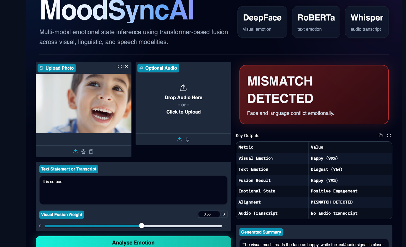
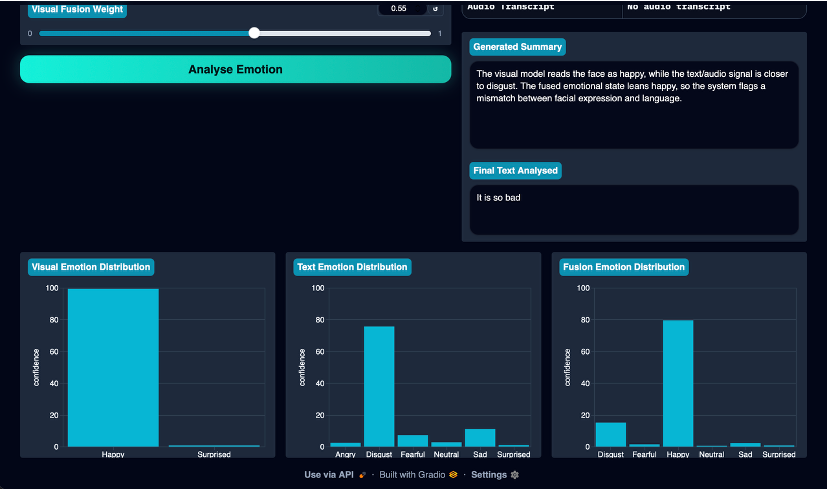

# MoodSyncAI — Multi-Modal Emotion Recognition System

## Overview

MoodSyncAI is a multi-modal AI-powered emotion recognition system that analyses human emotions using:

* **Facial expressions**
* **Textual sentiment**
* **Speech transcription**

The system combines predictions from multiple AI models using a multimodal fusion strategy to generate a unified emotional assessment and detect emotional inconsistencies between facial expressions and spoken language.


---

# Features

## Multi-Modal Emotion Analysis

The system accepts:

* Image input (face emotion recognition)
* Text input (sentiment/emotion classification)
* Optional audio input (speech transcription)

---

## Facial Emotion Recognition

Uses **DeepFace** for visual emotion analysis.

Detected emotions:

* Happy
* Sad
* Angry
* Fearful
* Surprised
* Disgust
* Neutral

---

## Text Emotion Classification

Uses a **Transformer-based RoBERTa model** from Hugging Face.

Model:

j-hartmann/emotion-english-distilroberta-base

---

## Audio Transcription

Uses OpenAI Whisper for speech-to-text transcription.

Model:

openai/whisper-tiny.en

---

## Multimodal Fusion Layer

A weighted fusion mechanism combines:

* Visual emotion probabilities
* Textual emotion probabilities

The system dynamically adjusts fusion weights based on model confidence.

---

## Emotion Alignment Detection

The system identifies:

* Aligned emotions
* Partial emotional alignment
* Emotional mismatches
* Mixed emotional states

Example:

Text: "Everything is fine."
Face: Sad expression
→ Mismatch Detected

---

## Generative Emotional Summary

The application generates a human-readable emotional interpretation summarising:

* Emotional state
* Alignment status
* Contextual emotional inconsistency

---

# Architecture

## System Workflow

```text
                 ┌─────────────────────┐
                 │     User Input      │
                 │ Image • Text • Audio│
                 └──────────┬──────────┘
                            │
        ┌───────────────────┼───────────────────┐
        │                   │                   │
        ▼                   ▼                   ▼

┌────────────────┐  ┌────────────────┐  ┌────────────────┐
│    DeepFace    │  │    RoBERTa     │  │    Whisper     │
│ Facial Emotion │  │  Text Emotion  │  │ Speech-to-Text │
└───────┬────────┘  └───────┬────────┘  └───────┬────────┘
        │                   │                   │
        ▼                   ▼                   ▼

┌────────────────┐  ┌────────────────┐  ┌────────────────┐
│ Visual Scores  │  │  Text Scores   │  │   Transcript   │
└───────┬────────┘  └───────┬────────┘  └───────┬────────┘
        └──────────────┬────┴──────────────┬────┘
                       ▼                  

              ┌──────────────────┐
              │   Fusion Module  │
              │ Weighted Fusion  │
              └────────┬─────────┘
                       │
          ┌────────────┴────────────┐
          ▼                         ▼

┌──────────────────┐     ┌──────────────────┐
│ Alignment Check  │     │ Summary Generator│
└────────┬─────────┘     └────────┬─────────┘
         └────────────┬───────────┘
                      ▼

           ┌────────────────────┐
           │   Gradio UI Output │
           │ Graphs • Metrics   │
           └────────────────────┘
```


---

# Tech Stack

## Frontend / UI

* Gradio
* Custom CSS

## Deep Learning / AI

* PyTorch
* Hugging Face Transformers
* DeepFace
* Whisper

## Data Processing

* Pandas
* NumPy
* Pillow

---

# Models Used

| Component          | Model                  | Purpose                        |
| ------------------ | ---------------------- | ------------------------------ |
| Visual Emotion     | DeepFace               | Facial emotion recognition     |
| Text Emotion       | DistilRoBERTa          | Text emotion classification    |
| Speech Recognition | Whisper Tiny           | Audio transcription            |
| Fusion Layer       | Custom Weighted Fusion | Multimodal emotion integration |

---

# Emotional Categories

The system supports **10 emotional states**:

| Primary Emotions | Derived Emotional States |
| ---------------- | ------------------------ |
| Happy            | Calm                     |
| Sad              | Frustrated               |
| Angry            | Confused                 |
| Fearful          |                          |
| Surprised        |                          |
| Disgust          |                          |
| Neutral          |                          |

---

# Key Functionalities

## Emotion Distribution Graphs

Displays:

* Visual emotion confidence
* Text emotion confidence
* Fusion emotion confidence

---

## Dynamic Fusion Weighting

The application allows users to adjust:

* Facial emotion importance
* Textual emotion importance

This enables better handling of emotionally conflicting scenarios.

---

## Error Handling

The system includes:

* Model inference error handling
* DeepFace compatibility handling
* Safe fallback mechanisms
* Input validation

---

# Installation

## Clone Repository

```bash
git clone https://github.com/yourusername/MoodSyncAI.git
cd MoodSyncAI
```

---

## Create Virtual Environment

### Windows

```bash
python -m venv venv
venv\Scripts\activate
```

### Mac/Linux

```bash
python3 -m venv venv
source venv/bin/activate
```

---

## Install Dependencies

```bash
pip install -r requirements.txt
```

---

# requirements.txt

```
gradio
transformers
torch
deepface
tf-keras
opencv-python
pandas
numpy
pillow
accelerate
sentencepiece
```

---

# Running the Application

```bash
python app.py
```

The application launches on:

```
http://127.0.0.1:8502
```
---

# Example Test Cases

## Aligned Emotion Example

### Text

```
"I am really excited about this project!"
```

### Expected

* Happy emotion
* Aligned state

---

## Mismatch Detection Example

### Text

```
"No, everything is perfectly fine."
```

### Face

Sad expression

### Expected

* Text → Neutral/Positive
* Face → Sad
* Fusion → Mismatch Detected

---

# Challenges Faced

## DeepFace Compatibility

Different DeepFace versions returned:

* dictionaries
* lists

Custom handling logic was implemented for compatibility.

---

## Transformer Label Mapping

The Hugging Face model labels did not directly match project emotion categories.

A custom label mapping pipeline was implemented.

---

## Fusion Calibration

Balancing facial and textual confidence scores required:

* dynamic weighting
* confidence-based adjustment
* mismatch threshold tuning

---

# Future Improvements

* Real-time webcam emotion tracking
* Live emotion timeline analysis
* Attention visualisation (Grad-CAM)
* Learned neural fusion network
* Multilingual emotion analysis
* Hugging Face Spaces deployment
* Docker containerisation
* REST API integration

---

# Deployment

Current deployment:

* Local Gradio web application
* Temporary Gradio public share links

---

# Skills Demonstrated

This project demonstrates practical experience in:

* Deep Learning
* Transformer models
* Computer Vision
* NLP
* Speech Processing
* Multimodal AI
* Model Fusion
* Human-AI Interaction
* Gradio UI Development
* Error Handling & Debugging
* AI Application Deployment

---
# Screenshots




# Repository Structure

```
MoodSyncAI/
│
├── app.py
├── styles.css
├── requirements.txt
├── README.md
├── screenshots/
│   ├── ui.png
│   ├── results.png
│   └── mismatch.png
│
└── assets/
```

---

# Author

Tejasri Elabotharam

---

# License

This project is intended for educational and research purposes.
